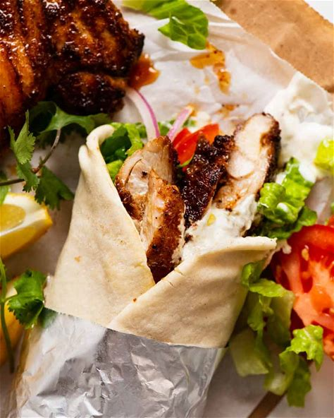

# odin-recipes
## index.html
<!DOCTYPE html>
<html lang="en">
<head>
    <meta charset="UTF-8">
    <meta name="viewport" content="width=device-width, initial-scale=1.0">
    <title>Recipes</title>
</head>
<body>
    <h1>Recipes Page</h1>
    <h2><a href="reciepes/sha.html"><strong>Shawarma</strong></a></h2>
      
    <h2><a href="reciepes/ice.html"><strong>Ice Cream</strong></a></h2>
      
    <h2><a href="reciepes/chicken.html"><strong>Chicken 65</strong></a></h2>
      
    <h2><a href="reciepes/atho.html"><strong>Atho</strong></a></h2>
      
    <h2><a href="reciepes/noodles.html"><strong>Noodles</strong></a></h2>
      
</body>
</html>

## noodles.html
<!DOCTYPE html>
<html lang="en">
<head>
    <meta charset="UTF-8">
    <meta name="viewport" content="width=device-width, initial-scale=1.0">
    <title>Document</title>
</head>
<body>
    <h1>Noodles Recipe</h1>
    <ol>
        <li>Make Noodles</li>
        <li>Cut Veggies</li>
        <li>Cut meat</li>
        <li>Mix everything with mayo and chess and grill it</li>
        <li>Serve Hot</li>
    </ol>
</body>
</html>

## chicken.html
<!DOCTYPE html>
<html lang="en">
<head>
    <meta charset="UTF-8">
    <meta name="viewport" content="width=device-width, initial-scale=1.0">
    <title>Document</title>
</head>
<body>
    <h1>Noodles Recipe</h1>
    <ol>
        <li>Cut Chicken</li>
        <li>Cut Lime and Onion</li>
        <li>Mix Chicken with masala batter or 65 batter</li>
        <li>Boil in oil till visible crispyness</li>
        <li>Serve with onion and lime juice</li>
    </ol>
</body>
</html>

## atho.html
<!DOCTYPE html>
<html lang="en">
<head>
    <meta charset="UTF-8">
    <meta name="viewport" content="width=device-width, initial-scale=1.0">
    <title>Document</title>
</head>
<body>
    <h1>Atho Recipe</h1>
    <ol>
        <li>Make noodles</li>
        <li>Cut cabbage</li>
        <li>Cut meat</li>
        <li>Mix everything and grill it</li>
        <li>Serve Hot</li>
    </ol>
</body>
</html>

## ice.html
<!DOCTYPE html>
<html lang="en">
<head>
    <meta charset="UTF-8">
    <meta name="viewport" content="width=device-width, initial-scale=1.0">
    <title>Document</title>
</head>
<body>
    <h1>ICE CREAM Recipe</h1>
    <ol>
        <li>Get milk</li>
        <li>Use jello</li>
        <li>add essence and flavour</li>
        <li>Freeze it</li>
        <li>Serve Cold</li>
    </ol>
</body>
</html>

## sha.html
<!DOCTYPE html>
<html lang="en">
<head>
    <meta charset="UTF-8">
    <meta name="viewport" content="width=device-width, initial-scale=1.0">
    <title>Document</title>
</head>
<body>
    <h1>Shawarma Recipe</h1>
    <ol>
        <li>Make Roll</li>
        <li>Cut Veggies</li>
        <li>Cut meat</li>
        <li>Mix everything with mayo and chess and grill it</li>
        <li>Serve Hot</li>
    </ol>
</body>
</html>

#### Result:
Thus successfully created this